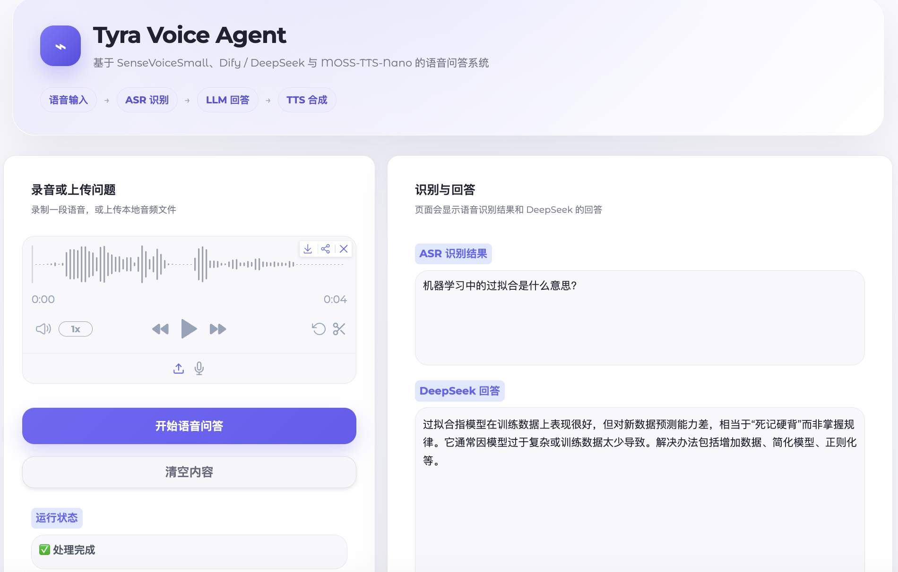
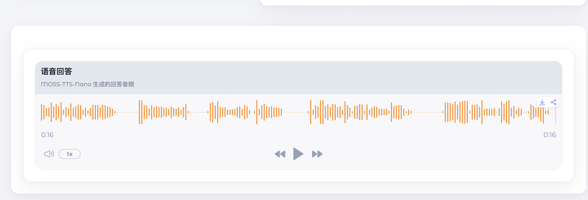

# Tyra Voice Agent

**录下一个问题，获得文字和语音回答。**

A speech-to-speech question-answering prototype built with SenseVoiceSmall, Dify / DeepSeek, MOSS-TTS-Nano, and Gradio.

[使用方式](#使用方式) · [运行准备](#运行准备) · [实验观察](#实验观察) · [开发日志](experiment_log.md)

## 这个项目做了什么

本项目将语音识别、大模型问答和语音合成接入同一个 Python 应用。用户在浏览器中录音或上传音频，程序将声音转成文字，通过 Dify 请求大模型回答，再将回答合成为语音。

开发日志记录了在 Apple Silicon Mac 上跑通完整流程的过程。当前版本用于本地单人演示与系统集成实践，尚未完成跨设备复现和系统性评测。

| 输入 | 处理 | 输出 |
| --- | --- | --- |
| 浏览器录音或本地音频 | 识别问题 → 生成回答 → 合成语音 | 识别文本、回答文本、可播放的回答音频 |

## 运行截图

以下为本地运行的真实截图。示例问题为「机器学习中的过拟合是什么意思？」：页面展示识别文本、正式回答和生成的语音播放器。





截图用于展示界面与本次输出；音频截图本身不包含可播放的声音。

## 使用方式

在环境配置完成并启动应用后：

1. 在网页左侧录制或上传一段问题音频。
2. 点击「开始语音问答」。
3. 等待处理完成，在右侧查看识别文本与回答。
4. 在下方播放器收听语音回答；浏览器未自动播放时可手动点击播放。

当前界面在整个流程完成后统一展示结果。每次提问独立处理，暂不保留前一轮对话。

## 实现与设计

| 模块 | 使用的组件 | 本项目中的工作 |
| --- | --- | --- |
| 语音识别（ASR） | FunASR / SenseVoiceSmall | 加载本地模型、接收音频、整理识别文本 |
| 问答（LLM） | Dify，开发时配置 DeepSeek | 封装 HTTP 请求，读取配置并处理接口错误 |
| 语音合成（TTS） | MOSS-TTS-Nano，ONNX 后端 | 调用独立 Conda 环境中的命令行程序，取得生成的 WAV |
| 网页界面 | Gradio | 接入录音、音频上传、文本展示与音频播放器 |

ASR 模型在进程启动时加载，后续请求复用。TTS 使用独立环境，以隔离其依赖。ASR 和 TTS 在本机执行，识别后的问题文本通过网络发送到所配置的 Dify 服务；该项目并非完全离线运行。

本项目的工作集中在组件集成、交互界面和调试记录；所使用的模型来自现有项目，没有进行模型训练或微调。

## 实验观察

开发时出现了一个值得继续研究的问题：**中文句子中的英文技术词可能被听错。**

以下内容摘自[原始开发日志](experiment_log.md)，属于少量手动测试案例：

| 实际说的话 | 日志记录的识别结果 |
| --- | --- |
| Give me a plain explanation of shell. | Give me a plain explanation of shell. |
| 请解释一下 shell 的意思。 | 🎼请解释一下sll的意思。 |
| 请解释一下 Linux Shell 的意思。 | 🎼请解释一下linux show的意思。 |

同一段录音从 M4A 转为 16 kHz 单声道 WAV 后，日志记录识别结果没有明显变化。这提供了后续检查中英混合识别问题的线索，但不足以排除所有音频因素，也不能据此推断模型的整体准确率。

原始录音和完整评测数据尚未随仓库提供；这些记录不是可重复的基准测试结果。后续可以固定录音、模型和配置，比较技术词识别情况，以及识别错误是否让最终回答偏离问题。

## 运行准备

### 已记录的开发环境

- Apple Silicon Mac，arm64。
- 主程序：Conda 环境 `voice-agent`，Python 3.10.20。
- 语音合成：独立 Conda 环境 `moss-tts-nano`，Python 3.12。
- 主程序涉及 `gradio`、`funasr`、`torch`、`torchaudio`、`requests`、`python-dotenv` 等依赖；开发日志还记录了 FFmpeg 的使用。

**仓库目前没有锁定依赖版本，也没有完整的自动安装脚本。**以上是已有开发记录，并非经过重新验证的一键安装方案。首次使用者需要先准备主程序依赖、Dify 应用及独立的 TTS 环境。

### 获取代码

```bash
git clone https://github.com/tingyukkk/voice-agent-demo.git
cd voice-agent-demo
```

### 配置 Dify

在项目根目录创建 `.env` 文件，填写自己应用的配置：

```dotenv
DIFY_API_KEY=replace_with_your_dify_app_key
DIFY_API_URL=https://api.dify.ai/v1
```

这里需要的是 **Dify 应用的 API Key**。模型供应商及其密钥在 Dify 中配置；自托管 Dify 时，应将 URL 替换为对应服务的 API 地址。不要将真实密钥提交到仓库。

### 检查 TTS 的本机路径

当前 [tts_client.py](tts_client.py) 使用以下约定：

| 项目 | 当前值 |
| --- | --- |
| Conda 可执行文件 | `~/miniforge3/bin/conda` |
| MOSS-TTS-Nano 项目目录 | `~/Projects/MOSS-TTS-Nano` |
| Conda 环境名 | `moss-tts-nano` |
| 参考音频，相对于 TTS 项目目录 | `assets/audio/zh_1.wav` |
| 输出音频，相对于 TTS 项目目录 | `generated_audio/moss_tts_nano_output.wav` |

需要自行准备 MOSS-TTS-Nano 项目、模型及其运行环境。这些文件不包含在本仓库中。

如果本机路径不同，需要修改 `tts_client.py`；修改输出目录时，也要同步修改 `app.py` 底部允许访问的音频目录。命令行播放使用 macOS 的 `afplay`。

### 检查组件并启动

在已有、配置完成的主程序环境中，先分别检查文字问答和语音合成：

```bash
conda activate voice-agent
python dify_client.py
python tts_client.py
```

两个命令分别运行并完成交互测试后，启动网页：

```bash
python app.py
```

打开终端输出的本地地址，默认通常是 `http://127.0.0.1:7860`。ASR 模型会在启动时加载，首次下载模型需要网络连接。

## 文件导航

| 文件 | 用途 |
| --- | --- |
| [app.py](app.py) | 网页界面与一次完整问答的处理流程 |
| [asr_client.py](asr_client.py) | 语音识别封装 |
| [dify_client.py](dify_client.py) | Dify 问答接口封装 |
| [tts_client.py](tts_client.py) | 语音合成调用与本地播放 |
| [voice_chat.py](voice_chat.py) | 命令行问答入口 |
| [asr_test.py](asr_test.py) | 开发时使用的 ASR 测试脚本 |
| [experiment_log.md](experiment_log.md) | 环境搭建、测试案例与故障排查记录 |

## 当前限制与下一步

- **复现：**依赖版本和 TTS 安装步骤需要补齐，并在干净环境中验证。
- **等待体验：**计划分阶段显示识别与回答；当前 TTS 失败会导致本次网页调用无法返回已有文字。
- **音频管理：**输出文件名固定，会覆盖旧回答；暂不适合多人同时使用。
- **评测：**计划整理中英混合技术词样本，记录识别结果与各阶段耗时。
- **界面：**当前布局偏向桌面屏幕，手机适配尚待改进。

以上为待完成事项。历史开发与排查过程见[实验日志](experiment_log.md)。
